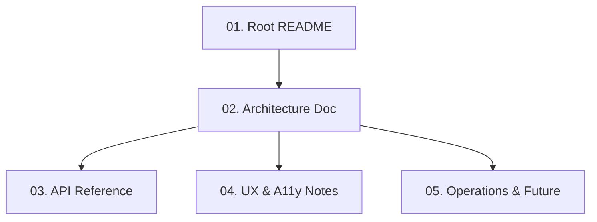

# DOCS 폴더 사용 가이드

**생성일**: 2025-12-02  
**목적**: 프로젝트 문서화 작성 시 DOCS 폴더 활용 방법  
**대상**: 문서 작성자, AI 에이전트, 신규 팀원

---

## 📋 DOCS 폴더란?

`docs/DOCS/` 디렉터리는 **프로젝트 문서 작성 가이드**를 제공합니다.

### 🎯 목적
- 새로운 개발자가 빠르게 온보딩
- 비개발자(교수님, 심사위원)가 개념 이해
- 미래의 팀이 설계와 의사결정을 빠르게 복기

### 📦 포함 내용
5개의 문서화 가이드:
1. **Root README 작성** - 프로젝트 전체 소개
2. **아키텍처 문서** - 시스템 구조 설명
3. **API 레퍼런스** - 엔드포인트 문서화
4. **UX & 접근성** - 사용자 경험 가이드
5. **운영 & 향후** - 배포 및 확장 계획

---

## 🗂️ DOCS 폴더 구조

```
docs/DOCS/
├── index.md                      # 문서화 가이드 인덱스
├── 01-root-readme-guide.md       # Root README.md 작성법
├── 02-architecture-doc.md        # ARCHITECTURE.md 작성법
├── 03-api-reference.md           # API.md 작성법
├── 04-ux-a11y-notes.md           # UX_A11Y.md 작성법
└── 05-operations-future.md       # OPERATIONS_FUTURE.md 작성법
```

---

## 🚀 빠른 시작

### 1️⃣ 문서 작성 시작 전

```bash
# DOCS 폴더 인덱스 읽기
cat docs/DOCS/index.md
```

**확인 사항**:
- [ ] 구현이 완료되었는가?
- [ ] 빌드가 성공하는가?
- [ ] 테스트가 통과하는가?

---

### 2️⃣ Root README 작성

```bash
# 가이드 읽기
cat docs/DOCS/01-root-readme-guide.md

# Root README.md 작성 (프로젝트 루트)
# 포함 내용:
# - 프로젝트 한글 요약
# - 주요 기능 목록
# - 기술 스택
# - 빠른 시작 (설치 & 실행)
```

**생성 파일**: `README.md` (프로젝트 루트)

---

### 3️⃣ 아키텍처 문서 작성

```bash
# 가이드 읽기
cat docs/DOCS/02-architecture-doc.md

# docs/ARCHITECTURE.md 작성
# 포함 내용:
# - 모노레포 구조
# - 레이어별 책임 (Mobile, Web, BFF, Supabase)
# - 데이터 플로우 (읽기/쓰기 분리)
# - DB 스키마 개요
```

**생성 파일**: `docs/ARCHITECTURE.md`

---

### 4️⃣ API 레퍼런스 작성

```bash
# 가이드 읽기
cat docs/DOCS/03-api-reference.md

# docs/API.md 작성
# 포함 내용:
# - 전체 엔드포인트 목록
# - 각 엔드포인트별 메서드, 요청, 응답, 에러
# - 인증 방식 (JWT Bearer Token)
# - 에러 코드 설명
```

**생성 파일**: `docs/API.md`

---

### 5️⃣ UX & 접근성 가이드 작성

```bash
# 가이드 읽기
cat docs/DOCS/04-ux-a11y-notes.md

# docs/UX_A11Y.md 작성
# 포함 내용:
# - 연령대별 UX (50대/60대/70대)
# - 3단계 접근성 모드 (Normal/Easy/Ultra)
# - UI 원칙 (큰 버튼, 명확한 피드백)
# - 텍스트 가이드 (폰트, 색상 대비)
# - TTS 사용법
```

**생성 파일**: `docs/UX_A11Y.md`

---

### 6️⃣ 운영 & 향후 가이드 작성

```bash
# 가이드 읽기
cat docs/DOCS/05-operations-future.md

# docs/OPERATIONS_FUTURE.md 작성
# 포함 내용:
# - 로컬/스테이징/프로덕션 환경
# - 로깅 & 모니터링
# - LLM 연동 (사기 검사, 음성 의도)
# - 향후 확장 계획
```

**생성 파일**: `docs/OPERATIONS_FUTURE.md`

---

## 📝 문서 작성 순서

문서는 **논리적 순서**대로 작성해야 합니다:



### 우선순위

1. 🔴 **MUST**: Root README, Architecture Doc
2. 🟡 **SHOULD**: API Reference, UX & A11y Notes
3. 🟢 **NICE**: Operations & Future

---

## 🎯 역할별 추천 문서

### 신규 개발자 온보딩
1. **README.md** - 프로젝트 전체 이해
2. **ARCHITECTURE.md** - 시스템 구조 파악
3. **API.md** - 엔드포인트 참조
4. **UX_A11Y.md** - 사용자 중심 설계 이해

### 비개발자 (교수님, 심사위원)
1. **README.md** - 프로젝트 가치 제안 이해
2. **UX_A11Y.md** - 사용자 경험 설계 확인
3. **ARCHITECTURE.md** (선택) - 기술 스택 개요

### DevOps / 운영팀
1. **README.md** - 빠른 시작
2. **ARCHITECTURE.md** - 인프라 구조
3. **OPERATIONS_FUTURE.md** - 운영 가이드

### 프론트엔드 개발자
1. **README.md** - 전체 개요
2. **API.md** - 엔드포인트 참조
3. **UX_A11Y.md** - UI/UX 가이드

### 백엔드 개발자
1. **README.md** - 전체 개요
2. **ARCHITECTURE.md** - 시스템 구조
3. **API.md** - 엔드포인트 스펙

---

## 💡 AI 에이전트 사용 팁

### ✅ 좋은 예

```
"docs/DOCS/01-root-readme-guide.md를 읽고 README.md 초안 작성해줘"

"docs/DOCS/03-api-reference.md를 참조하여 
/v1/cards 엔드포인트 문서화해줘"

"docs/DOCS/04-ux-a11y-notes.md에 따라 
접근성 모드 설명 추가해줘"
```

### ❌ 나쁜 예

```
"전체 문서를 다 읽고 모든 문서 작성해줘"
(→ 컨텍스트 오버플로우)

"문서 작성해줘"
(→ 어떤 문서인지 불명확)

"API 문서 만들어줘"
(→ 가이드 참조 없이 일관성 부족)
```

---

## 🔍 문서 작성 체크리스트

각 문서 작성 후 다음을 확인:

### 내용
- [ ] 대상 독자에게 명확한가?
- [ ] 핵심 질문에 답하는가?
  - "이게 뭔데?" (What)
  - "어떻게 돌아가는데?" (How)
  - "어디를 고치면 되는데?" (Where)
- [ ] 예시가 충분한가?

### 형식
- [ ] 코드 예시가 최신 상태인가?
- [ ] 링크가 모두 작동하는가?
- [ ] Markdown 문법이 올바른가?
- [ ] 헤더 레벨이 논리적인가?

### 품질
- [ ] 비개발자도 이해 가능한가? (README, UX_A11Y)
- [ ] 개발자가 온보딩 가능한가? (ARCHITECTURE, API)
- [ ] 운영팀이 배포 가능한가? (OPERATIONS_FUTURE)

---

## 🗺️ 문서 간 관계

```
README.md (전체 개요)
    ↓
ARCHITECTURE.md (구조 & 플로우)
    ↓
API.md (엔드포인트 상세)
    ↓
UX_A11Y.md (사용자 경험)
    ↓
OPERATIONS_FUTURE.md (운영 & 확장)
```

**설명**:
- README → 프로젝트 전체를 한눈에 파악
- ARCHITECTURE → 시스템 구조 이해 후 상세 문서로
- API, UX_A11Y, OPERATIONS → 역할별 심화 문서

---

## 🔗 관련 문서

### 이전 단계
- [PLAN](../PLAN/index.md) - 프로젝트 기획
- [IMPLEMENT](../IMPLEMENT/index.md) - 기능 구현
- [SCAFFOLD](../SCAFFOLD/index.md) - 뼈대 구축
- [TEST](../TEST/index.md) - 테스트 작성

### 현재 단계
- [DOCS 인덱스](../DOCS/index.md) - 문서화 가이드 전체 목록

### 다음 단계
- [ISSUES](../ISSUES/README.md) - 이슈 트래킹
- [WORK](../WORK/README.md) - 작업 세션 관리

---

## 📊 문서 통계

- **총 가이드 수**: 5개 + 인덱스
- **생성 문서 수**: 5개 (README + 4개 docs/)
- **대상 독자**: 개발자, 비개발자, DevOps, 디자이너
- **필수 문서**: README, ARCHITECTURE, API
- **권장 문서**: UX_A11Y, OPERATIONS_FUTURE

---

## ✅ 완료 기준

모든 문서 작성 완료 후:

### 문서 완성도
- [ ] Root README.md 작성 완료
- [ ] docs/ARCHITECTURE.md 작성 완료
- [ ] docs/API.md 작성 완료
- [ ] docs/UX_A11Y.md 작성 완료
- [ ] docs/OPERATIONS_FUTURE.md 작성 완료

### 품질
- [ ] 모든 코드 예시가 최신 상태
- [ ] 링크가 모두 작동
- [ ] 비개발자도 핵심 개념 이해 가능
- [ ] 개발자는 온보딩 가능

### 문서 인덱스
- [ ] 각 문서에 "언제 읽어야 하는지" 한 줄 요약 포함
- [ ] README에 문서 인덱스 링크 추가
- [ ] docs/README.md에 DOCS 폴더 링크 추가

---

## 🎯 실전 예시

### 예시 1: Root README 작성

```bash
# 1. 가이드 읽기
cat docs/DOCS/01-root-readme-guide.md

# 2. AI에게 요청
"docs/DOCS/01-root-readme-guide.md를 읽고 
Trenduity 프로젝트의 README.md 초안 작성해줘.
프로젝트 소개, 기술 스택, 빠른 시작을 포함해줘."

# 3. 생성된 README.md 검토
- 프로젝트 목표가 명확한가?
- 설치 명령어가 작동하는가?
- 스크린샷이 필요한가?

# 4. 수정 및 완료
```

### 예시 2: API 레퍼런스 작성

```bash
# 1. 가이드 읽기
cat docs/DOCS/03-api-reference.md

# 2. BFF 라우터 확인
ls services/bff-fastapi/app/routers/

# 3. AI에게 요청
"docs/DOCS/03-api-reference.md를 참조하여
services/bff-fastapi/app/routers/cards.py의
모든 엔드포인트를 문서화해서 docs/API.md에 추가해줘."

# 4. 검증
- Swagger UI와 일치하는가?
- 에러 코드가 모두 문서화되었는가?
- 예시 요청/응답이 올바른가?
```

### 예시 3: UX 가이드 작성

```bash
# 1. 가이드 읽기
cat docs/DOCS/04-ux-a11y-notes.md

# 2. A11y 컨텍스트 확인
cat apps/mobile-expo/src/contexts/A11yContext.tsx

# 3. AI에게 요청
"docs/DOCS/04-ux-a11y-notes.md를 참조하여
3단계 접근성 모드 (Normal/Easy/Ultra)를
docs/UX_A11Y.md에 문서화해줘.
각 모드별 폰트 크기, 버튼 높이, 스페이싱을 포함해줘."

# 4. 검증
- UI 토큰과 일치하는가?
- 스크린샷이 필요한가?
- 사용자 테스트 결과가 포함되었는가?
```

---

## 🚨 주의 사항

### ❌ 하지 말 것
- 가이드 없이 임의로 문서 작성
- 코드 주석을 그대로 복사
- 영어로 문서 작성 (한국어 우선)
- 오래된 코드 예시 포함

### ✅ 해야 할 것
- DOCS 가이드를 먼저 읽기
- 최신 코드 확인 후 작성
- 한국어로 명확하게 작성
- 비개발자도 이해 가능하게 작성

---

## 📞 문의

문서 작성 중 문제 발생 시:
1. [DOCS 인덱스](../DOCS/index.md) 재확인
2. [문서 진행 트래커](../WORK_PROGRESS_TRACKER.md) 확인
3. [Copilot 지침서](../../.github/copilot-instructions.md) 참조

---

**작성자**: AI Copilot  
**최종 업데이트**: 2025-12-02  
**문서 버전**: 1.0
