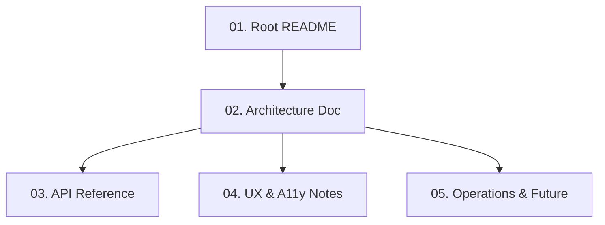

# DOCS - 문서화 가이드

> **목적**: 구현·시드·테스트가 완료된 레포지토리에 대해 명확하고 간결한 문서를 작성합니다.  
> **전제조건**: `docs/PLAN/`, `docs/IMPLEMENT/`, `docs/SEED/`, `docs/TEST/` 완료, 레포 빌드 성공  
> **대상**: Documentation lead (문서 작성자)

---

## 📋 개요

이 단계에서는 **프로젝트 문서화**를 통해 다음 목표를 달성합니다:

- 새로운 개발자가 빠르게 온보딩
- 비개발자(교수님, 심사위원, 파트너 등)가 개념 이해
- 미래의 팀이 설계와 의사결정을 빠르게 복기

**문서화 원칙**:

- 명확하고 간결하게 (과도하게 길지 않게)
- 핵심 질문에 답하기: "이게 뭔데?", "어떻게 돌아가는데?", "어디를 고치면 되는데?", "어떻게 시연하지?"
- 코드/설정 설명은 README/ARCHITECTURE에, 비즈니스/사용자 설명은 README/UX_A11Y에 분할

---

## 🗂️ 문서 구조

이 폴더는 **5개의 문서화 가이드**로 구성됩니다.

### 📄 문서화 가이드 목록

1. **[01-root-readme-guide.md](./01-root-readme-guide.md)**
   - Root README.md 작성 가이드
   - 프로젝트 한글 요약, 주요 기능, 기술 스택, 빠른 시작
2. **[02-architecture-doc.md](./02-architecture-doc.md)**
   - `docs/ARCHITECTURE.md` 작성 가이드
   - 모노레포 구조, 레이어 책임, 데이터 플로우, DB 스키마
3. **[03-api-reference.md](./03-api-reference.md)**
   - `docs/API.md` 작성 가이드
   - 엔드포인트별 메서드·요청·응답·에러
4. **[04-ux-a11y-notes.md](./04-ux-a11y-notes.md)**
   - `docs/UX_A11Y.md` 작성 가이드
   - 연령대별 UX, UI 원칙, 텍스트 가이드, TTS 사용
5. **[05-operations-future.md](./05-operations-future.md)**
   - `docs/OPERATIONS_FUTURE.md` 작성 가이드
   - 로컬/스테이징/프로덕션, 로깅·모니터링, LLM 연동, 향후 확장

---

## 🎯 문서화 순서

문서들은 **논리적 순서**대로 작성해야 합니다:



**우선순위**:

1. 🔴 **MUST** (Week 6 초): Root README, Architecture Doc
2. 🟡 **SHOULD** (Week 6 중): API Reference, UX & A11y Notes
3. 🟢 **NICE** (Week 6 말): Operations & Future

---

## 🚀 빠른 시작

### Step 1: 가이드 읽기

```bash
# 문서화 시작 전 필수
cat docs/DOCS/01-root-readme-guide.md
```

### Step 2: 첫 번째 문서 작성

```bash
# Root README부터 시작
cat docs/DOCS/01-root-readme-guide.md

# Root README.md 작성 (프로젝트 루트)
# 프로젝트 요약, 기능 목록, 기술 스택, 빠른 시작 포함
```

### Step 3: 검토

각 문서 작성 후 다음을 확인:

- [ ] 대상 독자(개발자/비개발자)에게 명확한가?
- [ ] 핵심 질문("이게 뭔데?", "어떻게?", "어디를 고치지?")에 답하는가?
- [ ] 코드 예시가 최신 상태인가?
- [ ] 링크가 모두 작동하는가?

---

## 📦 생성할 문서 대상

문서화 중 생성할 주요 파일들:

### 프로젝트 루트

```
README.md                  # 전체 프로젝트 개요 (개발자 + 비개발자)
```

### docs/ 폴더

```
docs/
├── ARCHITECTURE.md       # 시스템 아키텍처 (개발자용)
├── API.md                # API 레퍼런스 (클라이언트 개발자용)
├── UX_A11Y.md            # UX & 접근성 가이드 (디자이너/프론트엔드/심사위원)
└── OPERATIONS_FUTURE.md  # 운영 & 향후 확장 (DevOps/미래 팀)
```

---

## ✅ 완료 기준

모든 문서 작성 완료 후 다음을 확인하세요:

### 문서 완성도

- [ ] Root README.md 작성 완료 (프로젝트 요약 + 빠른 시작)
- [ ] docs/ARCHITECTURE.md 작성 완료 (모노레포 구조 + 데이터 플로우)
- [ ] docs/API.md 작성 완료 (전체 엔드포인트 문서화)
- [ ] docs/UX_A11Y.md 작성 완료 (연령대별 UX + UI 원칙)
- [ ] docs/OPERATIONS_FUTURE.md 작성 완료 (운영 가이드 + 확장 아이디어)

### 품질

- [ ] 모든 코드 예시가 최신 상태
- [ ] 링크가 모두 작동
- [ ] 비개발자도 핵심 개념 이해 가능
- [ ] 개발자는 온보딩 가능

### 문서 인덱스

- [ ] 각 문서에 "언제 읽어야 하는지" 한 줄 요약 포함
- [ ] README에 문서 인덱스 링크 추가

---

## 🗺️ 문서 간 관계

```
README.md (전체 개요)
    ↓
ARCHITECTURE.md (구조 & 플로우)
    ↓
API.md (엔드포인트 상세)
    ↓
UX_A11Y.md (사용자 경험)
    ↓
OPERATIONS_FUTURE.md (운영 & 확장)
```

---

## 🎯 역할별 추천 읽기 순서

### 신규 개발자 온보딩

1. **README.md** - 프로젝트 전체 이해
2. **ARCHITECTURE.md** - 시스템 구조 파악
3. **API.md** - 엔드포인트 참조
4. **UX_A11Y.md** - 사용자 중심 설계 이해

### 비개발자 (교수님, 심사위원)

1. **README.md** - 프로젝트 가치 제안 이해
2. **UX_A11Y.md** - 사용자 경험 설계 확인
3. **ARCHITECTURE.md** (선택) - 기술 스택 개요

### DevOps / 운영팀

1. **README.md** - 빠른 시작
2. **ARCHITECTURE.md** - 인프라 구조
3. **OPERATIONS_FUTURE.md** - 운영 가이드

### 프론트엔드 개발자

1. **README.md** - 전체 개요
2. **API.md** - 엔드포인트 참조
3. **UX_A11Y.md** - UI/UX 가이드

### 백엔드 개발자

1. **README.md** - 전체 개요
2. **ARCHITECTURE.md** - 시스템 구조
3. **API.md** - 엔드포인트 스펙

---

## 🔗 관련 문서

- **이전 단계**: [TEST](../TEST/index.md) - 테스트 작성
- **기획 문서**: [PLAN](../PLAN/index.md) - 전체 계획
- **구현 가이드**: [IMPLEMENT](../IMPLEMENT/index.md) - 기능 구현

---

## 💡 사용 팁

### AI와 작업 시

- ✅ **좋은 예**: "01-root-readme-guide.md를 읽고 README.md 초안 작성해줘"
- ❌ **나쁜 예**: "전체 문서를 다 읽고 모든 문서 작성해줘" (컨텍스트 오버플로우)

### 문서 검토 시

- 관련 코드 예시가 최신 상태인지 확인
- 링크가 모두 작동하는지 확인
- 비개발자가 읽었을 때 이해 가능한지 확인

### 온보딩 시

- 신규 팀원: README → ARCHITECTURE → 역할별 문서 순서로 읽기
- 1일차: README (전체 이해)
- 2일차: ARCHITECTURE (구조 파악)
- 3일차: 역할별 문서 (상세 파악)

---

## 📊 문서 통계

- **총 문서 수**: 5개 가이드 + 5개 생성 문서
- **대상 독자**: 개발자, 비개발자, DevOps, 디자이너
- **필수 문서**: README, ARCHITECTURE, API
- **권장 문서**: UX_A11Y, OPERATIONS_FUTURE

---

**문서 작성**: AI Documentation Guide Generator  
**최종 업데이트**: 2025년 11월 14일  
**문서 버전**: 1.0
