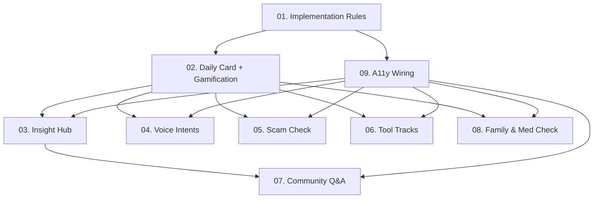

# IMPLEMENT - 기능 구현 가이드

> **목적**: SCAFFOLD 단계에서 생성된 레포지토리 골격에 MVP 핵심 기능을 end-to-end로 구현합니다.  
> **전제조건**: `docs/PLAN/`, `docs/SCAFFOLD/` 완료, 모노레포 빌드 성공  
> **대상**: Feature implementation lead (코드 작성자)

---

## 📋 개요

이 단계에서는 **9개 도메인의 핵심 기능**을 DB → BFF → Mobile → Web 순서로 완전히 구현합니다.

**구현 원칙**:
- 심플하고 명확한 코드 (over-engineering 금지)
- TypeScript strict 모드, FastAPI 타입 체크 통과
- 50-70대 사용자를 위한 접근성 우선
- 명확한 에러 메시지 (한국어)

---

## 🗂️ 문서 구조

이 폴더는 **8개의 기능 구현 문서**와 **1개의 규칙 문서**로 구성됩니다.

### 📄 구현 규칙
- **[01-implementation-rules.md](./01-implementation-rules.md)**
  - 전역 구현 규칙 (에러 처리, 접근성, 데이터 접근)
  - 코드 스타일 가이드
  - 금지 사항

### 🔧 기능별 구현 가이드

1. **[02-daily-card-gamification.md](./02-daily-card-gamification.md)**
   - 오늘의 카드 + 퀴즈 + 게임화 기준선
   - DB 설계, BFF 엔드포인트, 모바일 UI
   - 포인트/스트릭 로직

2. **[03-insight-hub.md](./03-insight-hub.md)**
   - 인사이트 허브 (주제별 필터링)
   - 팔로우 기능, TTS 통합
   - 리스트/상세 화면

3. **[04-voice-intents.md](./04-voice-intents.md)**
   - 6가지 음성 인텐트 (전화, 문자, 검색 등)
   - 한국어 파싱 로직
   - VoiceOverlay 컴포넌트

4. **[05-scam-check.md](./05-scam-check.md)**
   - 사기 문자/URL 검사
   - 위험도 판정 (danger/warn/safe)
   - 대응 팁 제공

5. **[06-tool-tracks.md](./06-tool-tracks.md)**
   - 도구 실습 트랙 (Canva/Miri/Sora)
   - 단계별 진행 추적
   - 완료 시 게임화 포인트

6. **[07-community-qna.md](./07-community-qna.md)**
   - 가벼운 커뮤니티 (리액션 + Q&A)
   - 익명 질문 지원
   - AI 요약 생성

7. **[08-family-med-check.md](./08-family-med-check.md)**
   - 가족 연동 (초대/권한)
   - 복약 체크 기능
   - 사용량 대시보드 (웹)

8. **[09-a11y-wiring.md](./09-a11y-wiring.md)**
   - 접근성 모드 (normal/easy/ultra)
   - 폰트/간격/버튼 크기 토큰 적용
   - 전체 앱 통합

---

## 🎯 구현 순서

기능들은 **의존성 순서**대로 구현해야 합니다:



**우선순위**:
1. 🔴 **MUST** (Week 1-2): Daily Card, Gamification, Insight Hub
2. 🟡 **SHOULD** (Week 3-4): Voice, Scam Check, Tool Tracks, A11y
3. 🟢 **NICE** (Week 5-6): Community, Family, Polish

---

## 🚀 빠른 시작

### Step 1: 규칙 읽기
```bash
# 구현 시작 전 필수
cat docs/IMPLEMENT/01-implementation-rules.md
```

### Step 2: 첫 번째 기능 구현
```bash
# Daily Card부터 시작
cat docs/IMPLEMENT/02-daily-card-gamification.md

# DB 마이그레이션 (Supabase)
# BFF 라우터 구현 (FastAPI)
# Mobile 화면 구현 (React Native)
```

### Step 3: 수동 테스트
각 문서 끝에 있는 **테스트 체크리스트** 참조:
- [ ] DB 데이터 삽입 확인
- [ ] BFF API 응답 확인 (Postman/curl)
- [ ] Mobile 화면 렌더링 확인
- [ ] 에러 케이스 확인

---

## 📦 파일 수정 대상

구현 중 수정할 주요 파일들:

### BFF (FastAPI)
```
services/bff-fastapi/
├── app/
│   ├── routers/
│   │   ├── cards.py          # Daily Card 엔드포인트
│   │   ├── insights.py       # Insight Hub 엔드포인트
│   │   ├── voice.py          # Voice Intents
│   │   ├── scam.py           # Scam Check
│   │   ├── tools.py          # Tool Tracks
│   │   ├── qna.py            # Community Q&A
│   │   └── family.py         # Family & Med
│   ├── services/
│   │   ├── gamification.py   # 게임화 로직
│   │   ├── voice_parser.py   # 음성 파싱
│   │   └── scam_checker.py   # 사기 검사
│   └── schemas/
│       └── dtos.py           # Pydantic 모델
```

### Mobile (Expo RN)
```
apps/mobile-rn/
├── src/
│   ├── screens/
│   │   ├── HomeAScreen.tsx           # Daily Card
│   │   ├── InsightListScreen.tsx    # Insight 목록
│   │   ├── InsightDetailScreen.tsx  # Insight 상세
│   │   ├── VoiceOverlay.tsx         # 음성 인터페이스
│   │   ├── ScamCheckSheet.tsx       # 사기 검사
│   │   ├── ToolTrackScreen.tsx      # 도구 실습
│   │   ├── QnAScreen.tsx            # Q&A
│   │   └── MedCheckScreen.tsx       # 복약 체크
│   ├── hooks/
│   │   ├── useTodayCard.ts
│   │   ├── useInsightList.ts
│   │   └── useA11y.ts
│   └── contexts/
│       └── A11yContext.tsx
```

### Web (Next.js)
```
apps/web-console/
└── app/
    ├── dashboard/
    │   └── page.tsx          # 대시보드 (사용량 통계)
    ├── members/
    │   └── [id]/page.tsx     # 멤버 상세 (활동 내역)
    └── alerts/
        └── page.tsx          # 알림 (복약 미체크 등)
```

---

## ✅ 완료 기준

모든 기능 구현 완료 후 다음을 확인하세요:

### 기능 완성도
- [ ] 8개 기능 모두 DB → BFF → Mobile 연결 완료
- [ ] 웹 콘솔 필수 화면 (대시보드, 멤버 관리) 완료
- [ ] 에러 처리 및 로딩 상태 처리 완료

### 코드 품질
- [ ] TypeScript/Python 타입 체크 통과
- [ ] ESLint/Prettier 통과
- [ ] 모든 API 엔드포인트 정상 응답

### 접근성
- [ ] A11y 토큰 적용 (폰트/간격/버튼)
- [ ] TTS 연동 (카드, 인사이트)
- [ ] 큰 버튼 (≥48dp) 적용

### 문서화
- [ ] 각 기능별 수동 테스트 체크리스트 작성
- [ ] 부분 구현 (stub) 항목 명시
- [ ] README에 실행 방법 업데이트

---

## 🔗 관련 문서

- **이전 단계**: [SCAFFOLD](../SCAFFOLD/index.md) - 레포지토리 골격
- **기획 문서**: [PLAN](../PLAN/index.md) - 도메인 및 요구사항
- **다음 단계**: SEED (데이터 시딩), TEST (테스트 작성)

---

## 📝 TODO 컨벤션

코드 내 TODO 주석 사용 규칙:

```typescript
// TODO(실명): 설명 [우선순위]
// 예시:
// TODO(alice): LLM 요약 연동 [P2]
// TODO(bob): Redis 캐싱 추가 [P3]
```

**우선순위**:
- `[P0]`: MVP 차단 이슈 (즉시 해결)
- `[P1]`: MVP 필수 기능 (Week 1-2)
- `[P2]`: MVP 권장 기능 (Week 3-4)
- `[P3]`: Post-MVP 개선 사항

---

## 🤝 협업 가이드

### 팀원별 권장 문서
- **백엔드 개발자**: 01 → 02 → 03 → 04 → 05 → 06 → 07 → 08
- **프론트엔드 (모바일)**: 01 → 09 → 02 → 03 → 04 → 05 → 06 → 07 → 08
- **프론트엔드 (웹)**: 01 → 08 (가족 대시보드)
- **QA**: 모든 문서의 "테스트 체크리스트" 섹션

### 병렬 작업 가능
- Daily Card (02) ↔️ Insight Hub (03)
- Voice Intents (04) ↔️ Scam Check (05)
- Tool Tracks (06) ↔️ Community (07)

---

**문서 작성**: AI Implementation Guide Generator  
**최종 업데이트**: 2025년 11월 13일
